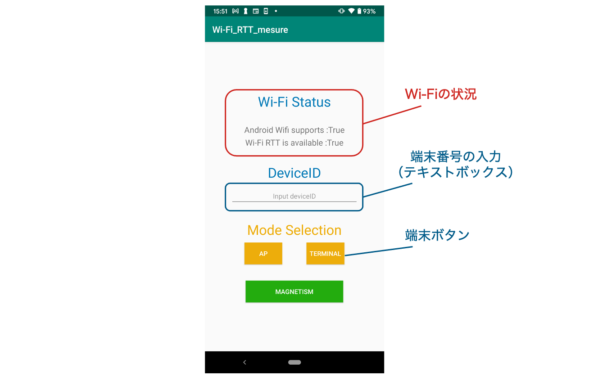
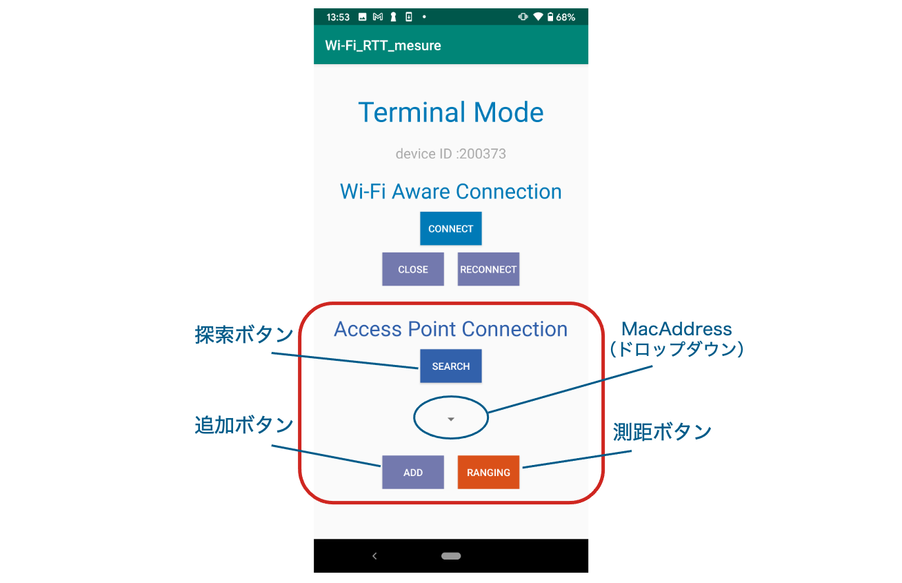
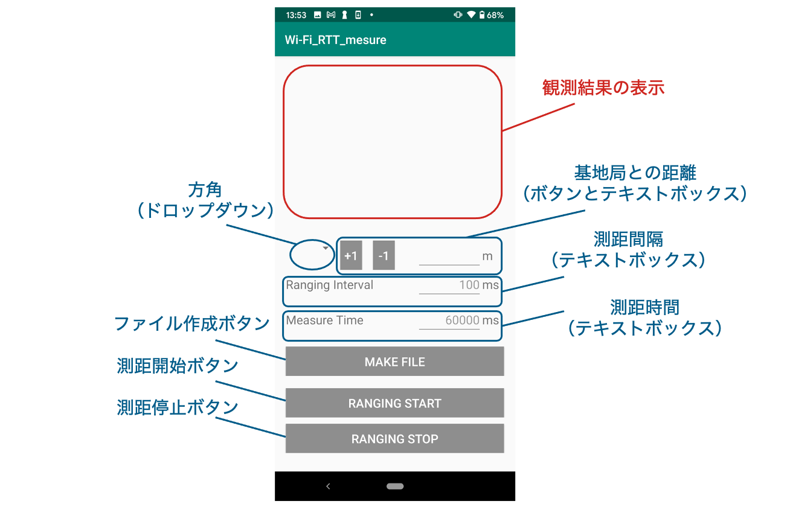

# Wi-Fi RTTアプリケーション

## 使用方法（Wi-Fi基地局との通信）

### 端末番号の設定とモードの選択

1. 初期画面で端末番号を入力
2. 3つのモードから端末モード（Terminal）を選択

端末番号はデータ出力ファイルのデフォルト名の一部に使われます。

Wi-Fi Statusに端末のWi-Fiの設定状況が出力されます。

- Android Wifi supports：端末のWi-Fiが利用可能かどうか
- Wi-Fi RTT is available：Wi-Fi RTTが利用可能な端末かどうか

"Android Wifi supports"と"Wi-Fi RTT is available"の両方が"True"になっていないと距離測定ができません。"False"と出ている場合は端末の設定、もしくは端末のサポートを確認してください。

注意：端末番号は6桁の数字で入力する必要があり、入力しないと次に進めません。

### 基地局との接続

1. 探索ボタン（Search）を押す
2. "探索完了"とToastが表示された後に追加ボタン（Add）を押す
3. ドロップダウンリストに対象となる基地局のMacAddressがあることを確認
4. ある場合は測距ボタン（Ranging）を押して距離測定画面へ、ない場合は端末の戻るボタンを押して初期画面からやり直し

注意：追加ボタンを何度も押すと同じ基地局が測距相手として複数回登録されてしまいます。追加ボタンは一度押すだけにしてください。

補足：Wi-Fi Aware Connectionは携帯端末と携帯端末との距離測定時の設定に使用します。今回は使用しません。

### 距離測定の設定と開始

1. 距離測定の設定
2. 設定完了後、ファイル作成ボタン（Make file）を押す
3. ファイル保存画面が立ち上がり、ファイルの出力先とファイル名を指定
4. 測距開始ボタン（Ranging Start）で距離測定を開始
5. 設定時間を超えると自動的に距離測定が停止（または、測距停止ボタン（Ranging Stop）で距離測定を停止

注意：まれに、設定時間を超えても距離測定が自動的に停止しない場合があります。

距離測定の設定できる内容を以下に示します。

- 観測者が向いている方角（N、NEなど）：ドロップダウンリストから選択
- 基地局との距離：テキストボックスもしくは、+1、-1ボタンで入力
- 測距間隔（Ranging Interval）：テキストボックスに入力（デフォルトは100ms）
- 測距時間（Measure Time）：テキストボックスに入力（デフォルトは60000ms）

観測者が向いている方角と基地局との距離は、端末番号と一緒にファイル名の一部に利用されます。例えば、端末番号が200373、方角がN、基地局との距離が4mの場合、”200373_4m_N.csv”がデフォルトのファイル名となります。デフォルトのファイル名はファイル保存画面で書き換え可能です。

### 出力ファイル形式

ファイルはCSV形式で出力されます。

データの1行目は基地局のMacAddressが書き込まれています。2行目以降はMacAddressに対応するデータが以下のように4列ずつ並んでいます。

- 1列目：距離測定結果（mm単位）
- 2列目：距離測定結果の標準偏差（mm単位）
- 3列目：電波強度（dBm）
- 4列目：TimeStamp

データ2行目から順番に時系列順に並んでおり、同じ行のデータは同時刻に観測されたデータです。また、データはアプリケーションで一切加工をしておらず、全て生のデータを出力しています。